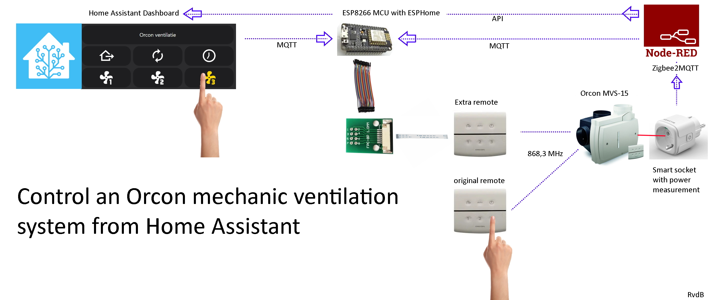
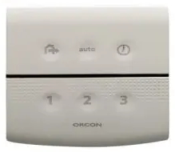
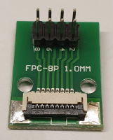
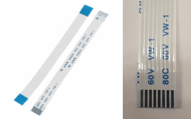
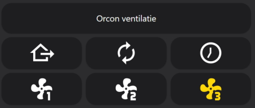
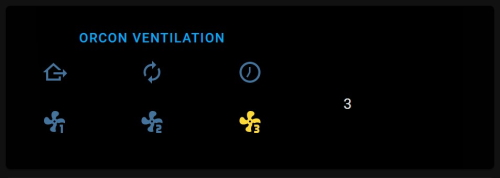

# Control an Orcon mechanic ventilation system from Home Assistant


*Based on an original Orcon remote*

## Introduction

For a few years this project was on top of my automation wishlist. I tried different approaches to get this done, and now it works like a charm I want to share my solution and the knowledge I gathered over the years.  

I know there are much more people like me struggling to get this automated.

On this page you can read all about how you can set it up yourself.

<details>
  <summary><b>> Click here to see all compatible Orcon systems >></b></summary>

Because the Orcon remote 15RF is compatible with a lot of Orcon ventilation models this solution will work if you have one of these models: 
 Compact-10RHB, MPV-10WRB, MVS-15R, MVS-15RH, MVS-15RHB, MVS-5RHBP, MVS-15RH, HRC-300/400-15BRH, HRC-300/400BRPH-15, HRC-220/225-15BR, HRC-300/400/500, HRC-425/570, HRC-350/450.
</details>

## My solution

With my solution I use an extra original remote connected and controlled by an ESP8266.


Now I can control it from my Home Assistant dashboard.  
I created three different designs to control it to see which one I like the most. You can find all code on this page.

<a href="#home-assistant-dashboard-remotes"></a>

I can also automatic trigger it, via MQTT, from Node-RED based on different sensors around the house.

---

## Table of Contents
<!-- TOC -->
* [Schematic presentation](#schematic-presentation)
* [Required hardware](#required-hardware)
* [Connect the hardware](#connect-the-hardware)
* [ESPHome](#esphome)
* [Register the remote to the ventilation system](#register-the-remote-to-the-ventilation-system)
* [Test if it works](#test-if-it-works)
* [Read the current mode](#read-the-current-mode)
* [Home Assistant dashboard remotes](#home-assistant-dashboard-remotes)
* [Triggers](#triggers)
* [Possible improvements](#possible-improvements)
* [Other approaches to control it](#other-approaches-to-control-it)
* [References](#references)
* [Credits](#credits)
<!-- TOC -->

---

## Schematic presentation

A schematic presentation of how my solution works and which protocols are used.



---

## Required hardware

These hardware components do I use for this project:

* Original Orcon 15RF remote control [link 1](https://www.ventilatieshop.com/orcon-afstandbediening-rf-voor-mvs-woonhuisventilatoren/) [link 2](https://123ventilatie.nl/product/orcon-draadloze-zender-afstandbediening-15rf/)


* ESP8266 NodeMCU v3 (or comparable) [link 1](https://aliexpress.com/item/32520574539.html) [link 2](https://aliexpress.com/item/1005001636634198.html)


* Dupont female to female wires [link 1](https://aliexpress.com/item/1005003007413890.html) [link 2](https://aliexpress.com/item/1005002046765371.html)


* Adapter 8 pins, 1 mm pitch (NOT the 0.5 mm), with pin head [link 1](https://aliexpress.com/item/32974345886.html) [link 2](https://aliexpress.com/item/1005001311060175.html)



* Flat cable 8 pins, 1 mm pitch (NOT the 0.5 mm) [link 1](https://aliexpress.com/item/1005001603277462.html) [link 2](https://aliexpress.com/item/1005002316479373.html)
  * The length and if the connectors are on the same side is up to you



* Micro USB cable to power the ESP [link 1](https://aliexpress.com/item/32951467674.html) [link 1](https://aliexpress.com/item/1005001741508596.html)


* 5V USB power adapter to power the ESP [link 1](https://aliexpress.com/item/4000016006173.html) [link 2](https://aliexpress.com/item/1005003080781367.html)


* (optional) Smart power socket with power measurement. I use the Zigbee BlitzWolf SHP-15 [link 1](https://www.banggood.com/BlitzWolf-BW-SHP15-Zigbee-3_0-16A-3680W-Smart-Plug-Wireless-Power-Socket-Outlet-EU-Plug-APP-Remote-Control-or-Voice-Control-or-Multiple-Timer-Modes-Compatible-With-Amazon-Alexa-or-Google-Assistant-p-1856492.html)


No affiliate links are used here, only some example links where you can buy the required parts for this project.

Found a dead link? [Please inform me](https://github.com/vdbrink/vdbrink.github.io/issues) 

---

## Connect the hardware

I've made close up photos and a table how everything is connected.

### Connect the RF15 remote to the ESP

> Use control + click to see the full photos of the connected wires.

| Connected pins close up                                               | All connected cables                                                       | Pins on a ESP8266 MCU v3|
|-----------------------------------------------------------------------|----------------------------------------------------------------------------|--|
|  |  |  |

This table show how the Orcon remote is connected, via the flat cable to the adapter, via the dupont cables with the ESP.

| Flat cable +<br>adapter pin | 15RF remote button | Dupont cable color | ESP pin |
|-----------------------------|--------------------|--------------------|---------|
| 1                           | -                  | -                  | -       |
| 2                           | timer*             | -                  | -       |
| 3                           | ground             | purple             | G       |
| 4                           | automatic          | blue               | D1      |
| 5                           | away*              | -                  | -       |
| 6                           | mode 3             | green              | D6      |
| 7                           | mode 2             | yellow             | D5      |
| 8                           | mode 1             | orange             | D2      |

> I haven't connected the 'timer' and 'away' buttons because I don't use them.

You can also replace the 3V CR 2032 battery from the remote and connect it to the ESP which can also provide the required 3V.

### Connect the smart socket

Place the smart power socket between the Orcon and the power wall plug.\
Based on the used power I can determ the current state.

---

## ESPHome


### Functionality
With ESPHome you can flash the ESP8266 with software to trigger the connected remote buttons by using the momentary switch functionality. This puts, for a few moments, a signal on a pin. This simulates a press on the button.
Because the ESP8266 has wi-fi access you can control this from any device in the network.

### Why ESPHome
ESPHome has seamless integration with Home Assistant and supports MQTT out of the box. This is all I need.
In the code there are also these two ways defined to control the ESP. One via the `api` and the other one via `mqtt`. Via `api` all switches will automatically be discovered by Home Assistant. Via `mqtt` you can control it also from other applications like Node-RED.

### Flash the ESP

Connect the ESP via USB with the computer.  

Install ESPHome and compile the configuration code after you configured your own wi-fi. And configure (or remove) the MQTT section.

For more information about installing and flashing your ESP with ESPHome see the [ESPHome website](https://esphome.io/guides/getting_started_command_line.html) or [Peyanski ESPHome Installation Guide](https://peyanski.com/complete-esphome-installation-guide/#How_to_properly_connect_an_ESP_device_for_ESPHome_install).

<details>
  <summary><b>> Click here to see the ESPHome configuration file >></b></summary>

```yaml
# Sourcecode by vdbrink.github.io
esphome:
  name: orcon_mcu
  platform: ESP8266
  board: nodemcuv2

wifi:
  ssid: "xxx"
  password: "xxx"
  fast_connect: true # Add when your SSID is hidden

# Enable logging
logger:

ota:

# Home Assistant integration
api:

sensor:
  - platform: wifi_signal
    name: "Orcon ESP Signal Strength"
    update_interval: 300s
    
switch:
  - platform: gpio
    pin: D1
    inverted: True
    id: buttonA
  - platform: gpio
    pin: D2
    inverted: True
    id: button1
  - platform: gpio
    pin: D5
    inverted: True
    id: button2
  - platform: gpio
    pin: D6
    inverted: True
    id: button3
  - platform: template
    name: "Mode automatic"
    icon: "mdi:autorenew"
    turn_on_action:
    - switch.turn_on: buttonA
    - delay: 500ms
    - switch.turn_off: buttonA
  - platform: template
    name: "Mode 1"
    icon: "mdi:numeric-1-circle-outline"
    turn_on_action:
    - switch.turn_on: button1
    - delay: 500ms
    - switch.turn_off: button1
  - platform: template
    name: "Mode 2"
    icon: "mdi:numeric-2-circle-outline"
    turn_on_action:
    - switch.turn_on: button2
    - delay: 500ms
    - switch.turn_off: button2
  - platform: template
    name: "Mode 3"
    icon: "mdi:numeric-3-circle-outline"
    turn_on_action:
    - switch.turn_on: button3
    - delay: 500ms
    - switch.turn_off: button3
  
# (Optional) Control the Orcon via MQTT
mqtt:
  broker: xxx.xxx.xxx.xxx
  port: 1883
  username: "xxx"
  password: "xxx"
  on_message:
    # the away mode triggers the auto mode
    - topic: orcon_mcu/mode_away
      then:
        - switch.turn_on: buttonA
        - delay: 500ms
        - switch.turn_off: buttonA
    - topic: orcon_mcu/mode_auto
      then:
        - switch.turn_on: buttonA
        - delay: 500ms
        - switch.turn_off: buttonA
    # the timer mode triggers the auto mode    
    - topic: orcon_mcu/mode_timer
      then:
        - switch.turn_on: buttonA
        - delay: 500ms
        - switch.turn_off: buttonA
    - topic: orcon_mcu/mode_1
      then:
        - switch.turn_on: button1
        - delay: 500ms
        - switch.turn_off: button1
    - topic: orcon_mcu/mode_2
      then:
        - switch.turn_on: button2
        - delay: 500ms
        - switch.turn_off: button2
    - topic: orcon_mcu/mode_3
      then:
        - switch.turn_on: button3
        - delay: 500ms
        - switch.turn_off: button3
```
</details>

> The remote has also three timer modes: 15/30/60 minutes.
If you want to add these also to your script checkout [this message](https://community.home-assistant.io/t/binary-template-sensor-not-woring/224593/23)  
If you want to read all about the remote possibilities, I placed a link to the Dutch manual in the [References](#references) chapter.

#### Problems with flashing
* He won't connect to my wifi network
  * Make sure you use a different name for your 2.4 GHz network and another name for your 5 GHz network. The ESP can't connect to a 5 GHz network but if it has the same name he still tries to. You can test if that's the case by disabling the 5GHz network mode in your router and see if the ESP now gets an IP-address correct.
  
* Make sure you see a green "SUCCESS" message after flashing and not any red error messages.
  * Maybe the indenting is not correct. YAML is strict with a correct indenting. You can try https://www.yamllint.com/ to validate. 
---
## Register the remote to the ventilation system

I used the original remote touchpad to pair it with the system.

To register the 15RF Orcon remote as extra remote to the ventilation system you need to shut down the power and power up again the ventilation system. For 3 minutes it's now in pairing mode. press the `auto` and `1` buttons at the same time. When the led on the remote start blinking green and red it's paired.

If you have another remote this is still paired and don't need to pair it again.

Now you can unplug the data cable from the touchpad and connect it to the flatcable. This has no effect on the paired status.


---
## Test if it works
### Via MQTT
One way to test if the ESP now works is to send a MQTT message.  
On Windows you can use MQTT Explorer. Send an empty body to topic `orcon_mcu/mode_3` and listen if the system spins up.

### Via Home Assistant
If the ESP is not already auto-discovered by Home Assistant you can go to Integrations and add the ESPHome integration. It will ask you for the IP-address and port number. I found the IP-address while flashing the ESP. The prefilled port `6053` is just fine. If it finds your device you see this:


When you click on the device link you see the defined buttons from the script.


You can now toggle the switches to test if you can control it now from Home Assistant.

With these controls it's only a one way communication, you can only send data to the ESP. To get feedback of the current active mode you also need to read the power consumption of your system.

---
## Read the current mode

### Background

To get the current mode of the ventilation system you can read the last triggered button from the ESP. The downside is, this wil not pick up the signal when another remote is used manually. For that purpose I use a BlitzWolf SHP-15 Zigbee smart power socket with power measurement for the MVS-15. This will only work if your system use a normal 240V power adapter and not via a Periflex adapter.
Based on the used power I can determine the current mode, and present that in Home Assistant via MQTT.

| Mode | Power consumption | 
|------|-------------------|
| 1    | 1 - 7             |
| 2    | 8 - 12            |
| 3    | 44 - 48           |

The power consumption for the three different modes, presented in Grafana.


### My feedback flow
This is how the current mode of the system gets into Home Assistant:

Zigbee Smart power socket -> Zigbee2MQTT -> MQTT -> Node-RED -> Home Assistant

I use for my smart flows not Home Assistant but Node-RED.

#### Node-RED

This is my flow.


Explanation of each node:

* **[mqtt in node]** The incoming power socket measurement via MQTT
* **[switch node]** Convert the power to a mode. See the corresponding [table](#Background).
* **[4 change nodes]** Set the value to present in Home Assistant.
* **[mqtt in node]** Read also direct the pressed button in Home Assistant via the triggered MQTT topic.
* **[switch node]** Is the current mode different then the current one, continue, otherwise stop. To avoid unneeded message when nothing is changed.
* **[switch node]** Store the new mode.
* **[HA API node]** Reset mode 1
* **[HA API node]** Reset mode 2
* **[HA API node]** Reset mode 3
* **[HA API node]** Set current mode

You can download this flow [here](orcon_files/node-red_flow.json).

#### Home Assistant

_If you implemented this flow direct in Home Assistant please [let me know](https://github.com/vdbrink/vdbrink.github.io/issues), so I can add that code also here._

---
## Home Assistant dashboard remotes

I created three different designs which can be used on your own Home Assistant dashboard.

When you press a button it triggers a service script which set a message on a MQTT topic. (Call direct the Home Assistant entity is also possible ofcourse.)

### Preparations

#### Create 6 helper switches

First you need to create six helper switches (Via Settings -> Devices & Services -> Helpers) which represent each button on the panel.
These buttons get activated by the Node-RED script to show which mode is the current active mode.

I used these icons:

| Mode      | Icon                         | 
|-----------|------------------------------|
| away      | mdi:home-export-outline      |
| automatic | mdi:autorenew                |
| timer     | mdi:clock-time-seven-outline |
| 1         | mdi:fan-speed-1              |
| 2         | mdi:fan-speed-2              |
| 3         | mdi:fan-speed-3              |

This is how a configured helper switch must look like:


#### Script to trigger the ESP

To act on a button press I created for each mode a script which trigger the ESP via MQTT. It also sets direct the selected mode on topic `orcon_mcu/mode`. 
I read this topic in Node-RED to give direct feedback to Home Assistant. Otherwise this feedback takes a while because then you have to wait until the power usage reach the level of the selected mode.

<details>
  <summary><b>> Click here to see the corresponding scripts.yaml code >></b></summary>

```yaml
# Sourcecode by vdbrink.github.io
switch_orcon_mode_1:
  alias: switch_orcon_mode_1
  sequence:
    - service: mqtt.publish
      data:
        topic: orcon_mcu/mode_1
    - service: mqtt.publish
      data:
        topic: orcon_mcu/mode
        payload: '1'
  mode: single
switch_orcon_mode_2:
  alias: switch_orcon_mode_2
  sequence:
    - service: mqtt.publish
      data:
        topic: orcon_mcu/mode_2
    - service: mqtt.publish
      data:
        topic: orcon_mcu/mode
        payload: '2'
  mode: single
switch_orcon_mode_3:
  alias: switch_orcon_mode_3
  sequence:
    - service: mqtt.publish
      data:
        topic:
          orcon_mcu/mode_3
    - service: mqtt.publish
      data:
        topic: orcon_mcu/mode
        payload: '3'
  mode: single
switch_orcon_mode_auto:
  alias: switch_orcon_mode_auto
  sequence:
    - service: mqtt.publish
      data:
        topic: orcon_mcu/mode_auto
    - service: mqtt.publish
      data:
        topic: orcon_mcu/mode
        payload: 'auto'
  mode: single
switch_orcon_mode_timer:
  alias: switch_orcon_mode_timer
  sequence:
    - service: mqtt.publish
      data:
        topic: orcon_mcu/mode_timer
    - service: mqtt.publish
      data:
        topic: orcon_mcu/mode
        payload: 'timer'
  mode: single
switch_orcon_mode_away:
  alias: switch_orcon_mode_away
  sequence:
    - service: mqtt.publish
      data:
        topic: orcon_mcu/mode_away
    - service: mqtt.publish
      data:
        topic: orcon_mcu/mode
        payload: 'away'
  mode: single
```
</details>

### My 3 designs

I created three different designs to see which looks the best for me.

In my first two designs you also get feedback and see what's the current active mode by the colored icon on the bottom row. You can't see it if someone used one of the top buttons.


#### Design 1: Home Assistant buttons

This design use the six created helper toggles which operate as buttons, and they are placed with multiple horizontal and vertical stacks on the right position in the same layout as the original Orcon remote.



<details>
  <summary><b>> Click here to see the service scripts YAML >></b></summary>

```yaml
# Sourcecode by vdbrink.github.io
# Dashboard card code
type: vertical-stack
cards:
  - type: horizontal-stack
    cards:
      - type: button
        name: Orcon ventilatie
        icon_height: 0px
        show_icon: false
  - type: horizontal-stack
    cards:
      - type: button
        name: Away
        entity: input_boolean.orcon_mode_away
        tap_action:
          action: call-service
          service: script.switch_orcon_mode_away
        icon: mdi:home-export-outline
        icon_height: 50px
        show_name: false
      - type: button
        name: Auto
        entity: input_boolean.orcon_mode_auto
        tap_action:
          action: call-service
          service: script.switch_orcon_mode_auto
        icon: mdi:autorenew
        icon_height: 50px
        show_name: false
      - type: button
        name: Timer
        entity: input_boolean.orcon_mode_timer
        tap_action:
          action: call-service
          service: script.switch_orcon_mode_timer
        icon: mdi:clock-time-seven-outline
        icon_height: 50px
        show_name: false
  - type: horizontal-stack
    cards:
      - type: button
        entity: input_boolean.orcon_mode_1
        tap_action:
          action: call-service
          service: script.switch_orcon_mode_1
        icon: mdi:fan-speed-1
        icon_height: 50px
        show_name: false
      - type: button
        entity: input_boolean.orcon_mode_2
        tap_action:
          action: call-service
          service: script.switch_orcon_mode_2
        icon: mdi:fan-speed-2
        icon_height: 50px
        show_name: false
      - type: button
        entity: input_boolean.orcon_mode_3
        tap_action:
          action: call-service
          service: script.switch_orcon_mode_3
        icon: mdi:fan-speed-3
        icon_height: 50px
        show_name: false
```
</details>

#### Design 2: Black panel

This black panel design is created with a `picture-element` with a black background image. The helper switches are relative positioned.  




<details>
  <summary><b>> Click here to see the corresponding dasboard YAML >></b></summary>

You have to place the [background image](../homeassistant/images/black.png) in the Home Assistant `www` directory.

```yaml
# Sourcecode by vdbrink.github.io
# Dashboard card code
type: picture-elements
image: /local/black.png
aspect_ratio: 6x2
elements:
  - type: service-button
    title: orcon ventilation
    service: homeassistant.empty
    service_data:
      entity_id: group.all_lights
    entity: input_boolean.orcon_mode_away
    style:
      top: 20%
      left: 30%
  - type: state-icon
    name: Away
    entity: input_boolean.orcon_mode_away
    tap_action:
      action: call-service
      service: script.switch_orcon_mode_away
    icon: mdi:home-export-outline
    icon_height: 100px
    show_name: false
    style:
      top: 40%
      left: 10%
  - type: state-icon
    name: Auto
    entity: input_boolean.orcon_mode_auto
    tap_action:
      action: call-service
      service: script.switch_orcon_mode_auto
    icon: mdi:autorenew
    icon_height: 50px
    show_name: false
    style:
      top: 40%
      left: 30%
  - type: state-icon
    name: Timer
    entity: input_boolean.orcon_mode_timer
    tap_action:
      action: call-service
      service: script.switch_orcon_mode_timer
    icon: mdi:clock-time-seven-outline
    icon_height: 50px
    show_name: false
    style:
      top: 40%
      left: 50%
  - type: state-icon
    entity: input_boolean.orcon_mode_1
    tap_action:
      action: call-service
      service: script.switch_orcon_mode_1
    icon: mdi:fan-speed-1
    icon_height: 50px
    show_name: false
    style:
      top: 70%
      left: 10%
  - type: state-icon
    entity: input_boolean.orcon_mode_2
    tap_action:
      action: call-service
      service: script.switch_orcon_mode_2
    icon: mdi:fan-speed-2
    icon_height: 50px
    show_name: false
    style:
      top: 70%
      left: 30%
  - type: state-icon
    entity: input_boolean.orcon_mode_3
    tap_action:
      action: call-service
      service: script.switch_orcon_mode_3
    icon: mdi:fan-speed-3
    icon_height: 50px
    show_name: false
    style:
      top: 70%
      left: 50%
  - type: state-label
    entity: sensor.orcon_orcon_state
    icon_height: 50px
    show_name: false
    style:
      top: 60%
      left: 70%
```
</details>

#### Design 3: Original remote

This design is a photo of the original remote with transparant buttons defined on the place of the actual buttons.
In this design you can't see the current mode.


To use this image on your dashboard you have to place the [remote panel photo](orcon_files/orcon_15rf_remote.jpg) and a [black square image](../homeassistant/images/black.png) in the Home Assistant `www` directory.
The black square is a placeholder to define an area to click.

<details>
  <summary><b>> Click here to see the corresponding dasboard YAML >></b></summary>

```yaml
# Sourcecode by vdbrink.github.io
# Dashboard card code
type: picture-elements
image: /local/orcon_15rf_remote.jpg
elements:
  - type: image
    entity: input_boolean.orcon_away
    title: Mode away
    tap_action:
      action: call-service
      service: script.switch_orcon_mode_away
      service_data: {}
      target: {}
    style:
      top: 30%
      left: 30%
      width: 20%
      height: 20%
    state_filter:
      'on': opacity(0%)
      'off': opacity(0%)
  - type: image
    entity: input_boolean.orcon_auto
    title: Mode auto
    tap_action:
      action: call-service
      service: script.switch_orcon_mode_auto
      service_data: {}
      target: {}
    style:
      top: 30%
      left: 50%
      width: 20%
      height: 20%
    state_filter:
      'on': opacity(0%)
      'off': opacity(0%)
  - type: image
    entity: input_boolean.orcon_timer
    title: Mode timer
    tap_action:
      action: call-service
      service: script.switch_orcon_mode_timer
      service_data: {}
      target: {}
    image: /local/black.png
    style:
      top: 30%
      left: 70%
      width: 20%
      height: 20%
    state_filter:
      'on': opacity(0%)
      'off': opacity(0%)
  - type: image
    entity: input_boolean.orcon_mode_1
    title: Mode 1
    tap_action:
      action: call-service
      service: script.switch_orcon_mode_1
      service_data: {}
      target: {}
    image: /local/black.png
    style:
      top: 65%
      left: 30%
      width: 20%
      height: 20%
    state_filter:
      'on': opacity(0%)
      'off': opacity(0%)
  - type: image
    entity: input_boolean.orcon_mode_2
    title: Mode 2
    tap_action:
      action: call-service
      service: script.switch_orcon_mode_2
      service_data: {}
      target: {}
    image: /local/black.png
    style:
      top: 65%
      left: 50%
      width: 20%
      height: 20%
    state_filter:
      'on': opacity(0%)
      'off': opacity(0%)
  - type: image
    entity: input_boolean.orcon_mode_3
    title: Mode 3
    tap_action:
      action: call-service
      service: script.switch_orcon_mode_3
      service_data: {}
      target: {}
    image: /local/black.png
    style:
      top: 65%
      left: 70%
      width: 20%
      height: 20%
    state_filter:
      'on': opacity(0%)
      'off': opacity(0%)
```
</details>

---

### Addition cards

#### Temperatures and humidity gauges


<details>
  <summary><b>> Click here to see the corresponding dashboard gauge YAML >></b></summary>

```yaml
# Sourcecode by vdbrink.github.io
# Dashboard card code
type: vertical-stack
cards:
- type: horizontal-stack
  cards:
    - type: gauge
      entity: sensor.temp5_temperature_rounded
      needle: true
      min: 15
      max: 35
      severity:
      green: 10
      yellow: 0
      red: 26
    - type: gauge
      entity: sensor.temp5_humidity_rounded
      needle: true
      severity:
      green: 45
      red: 60
      min: 45
      max: 100
- type: horizontal-stack
  cards:
    - type: gauge
      entity: sensor.temp9_temperature_rounded
      needle: true
      min: 15
      max: 35
      severity:
      green: 10
      yellow: 0
      red: 26
- type: horizontal-stack
  cards:
    - type: gauge
      entity: sensor.temp9_humidity_rounded
      needle: true
      severity:
      red: 30
      green: 45
      min: 30
      max: 100
    - type: gauge
      entity: sensor.temp2_humidity_rounded
      needle: true
      severity:
      green: 45
      red: 60
      min: 45
      max: 100
```
</details>

#### Grafana

I run Grafana where I can visualize the power consumption of my ventilation related device as the ventilation system itself but also the washing machine and dryer.

I integrated the exported Grafana dashboard in a vertical stack to stick them together in the dashboard.

[//]: # (For more details about this integration see [How to add Grafana dashboards to Home Assistant]&#40;../homeassistant/homeassistant_dashboard_grafana&#41;)


This is the corresponding YAML.
```yaml
# Sourcecode by vdbrink.github.io
# Dashboard card code
type: vertical-stack
cards:
  - type: iframe
    url: >-
      http://<ip>/<url1>?orgId=1&panelId=2&refresh=1m
    aspect_ratio: 50%
  - type: iframe
    ...
```

---
## Triggers

### Sensors and actuators

The system can automatically be controlled by different type of sensors and actuators:
- The original 15RF remote.
- A CO2 sensor (Not used in my setup). You can create one yourself [SenseAir S8 Co2 sensor](co2_senseair_s8_sensor).
- A temperature and humidity sensor (Aqara WSDCGQ11LM) in the extractor hood above the stove.
- A temperature and humidity sensor also somewhere else in the kitchen as reference. The humidity in the summer can be very low but in autumn very high for the whole day. In my experience if you use fixed values, to control the system, it can be that it will never drop below the 60%.


  
- A temperature and humidity sensor (Aqara WSDCGQ11LM) in the shower. I placed it in the extraction tube right above the shower. With the hole to measure the data pointed up.
- I also have a reference sensor outside the bathroom as reference data.


- A toilet VOC (Volatile Organic Compounds) sensor (Not yet realized)

### Automation script

I store my sensor data in an influxDB database which gives me the possibility to visualize all the data together in a Grafana dashboard.

Here you can see, one of my first scripts, the Orcon is automatic activated (yellow line) after the humidity in the shower is more than 70%, and it automatically shuts down when it's lower than 55%. 


#### Flow description


I created in Node-RED the next flow: 
If all the criteria are valid a trigger is sent to the Orcon to shut it down. If one of the criteria is not valid it stops the checks and sets a custom sensor with the reason why the orcon is still active.

Every 15 minutes this flow is triggered.

**Bathroom checks:**
* Is the dryer not active? 
  * The dryer is in the bathroom and produced a lot of heat.
* Is the humidity in the bathroom less than 70%?
  * If someone is in the shower the humidity reach 100%.
* Is the difference between the humidity in- and outside the bathroom less than 7%?
  * You can't work with fixed values it can be that it will never drop below the 60%. Especially in autumn.
* Is the bathroom temperature less than 26 degrees?
  * This can be caused by the dryer or taking a shower.

<br/>

**Kitchen extractor hood checks:**
* Is the humidity in the kitchen extractor hood less than 70%?
  *  When you heating food on the stove the humidity can rise and drop.
* Is the difference between the humidity in- and outside the extractor hood less than 7%?
  *  When you heating food on the stove the humidity will drop.
* Is the extractor hood temperature less than 26 degrees?
    * This can be caused by the dryer or taking a shower.

<br/>

**Other checks:**
* Is the Orcon started (manual) more than 10 minutes ago?
  * It can be that the orcon is started manually with the normal remote. Then it doesn't match all the previous criteria, but you still want to run it for some other reason.
* Is the VOC level in the toilet low enough? (Not in my setup)
* Is the CO2 level low enough? (Not in my setup)
* Is the Orcon still activate?
  * If also the last check match it can be shut down.

#### The Node-RED flow
This is the corresponding flow in Node-RED.

<a href="orcon_images/script_node-red.png" target="_blanc">

</a>

---
## Possible improvements
- Power the remote from the ESP
- Register the remote to the system via the ESP
- Activate the system based on toilet usage via a VOC sensor
- Show the current mode in design 3

---
## Other approaches to control it
There are other projects who use other ways to control the Orcon ventilation system.

### Clone the remote signals
The Orcon remote use a CC1101 RF module which does the RF wireless communication over 868,3 MHz. I tried to catch the remote signals with an RTL-SDR dongle and resend it. This didn't work and around the same time I found out it use a two-way communication system called "Honeywell Ramses II".
At that time there was no open implementation of it. Now there are. This approach stopped here for me.

### Control direct the motor
Other projects use a 0 - 10V PWM dimmer to overrule the voltage direct on the motor.


---
## References

More information about this subject.

[The base of my implementation](https://community.home-assistant.io/t/binary-template-sensor-not-woring/224593)

[Dutch forum, Tweakers.net, about this subject with multiple solutions](https://gathering.tweakers.net/forum/list_messages/1806429)

[Orcon 10RHB product page](https://www.orcon.nl/producten/compact-10rhb-ventilator-met-rf-bediening-en-vochtsensor/)

[Orcon remote 15RF manual Dutch](https://www.orcon.nl/wp-content/uploads/2021/10/handleiding-afstandsbediening-15rf-lr.pdf)


---
## Credits

This info helped me to eventually realize my implementation.

[Frank for sharing (t)his project](https://community.home-assistant.io/t/binary-template-sensor-not-woring/224593)
    
[tweakerVdR for sharing his HA code](https://gathering.tweakers.net/forum/view_message/66345082)

